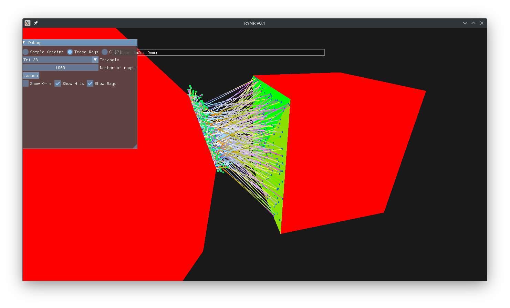

# Rayner

Meet **Rayner**, the vulkan.hpp based thermal raytracer for new space applications

This WIP project aim is to rebuild my old Bachelor's thesis on hardware accelerated raytracing and extend the functionality to also graphically represent the results of the obtained view factors.

The finished program should feature:

1. Graphical window, showing the geometry, traced rays and viewfactors
    - [x] Have a gui (imgui)
    - [ ] real time updated plots
2. Thermal raytracing
    - [x] launch rays from each triangle, show where they hit
    - [x] trace all individual triangles and be able to color all triangles in accordance to their absorbed energy
3. Compute Pipeline
    - [x] get from energy distribution to vf for each triangle
    - [ ] get from energy distribution to vf for each mesh

## current state

## Future:

- Integrate Environmental Fluxes
- Integrate Orbit Propagation
- Simulate the residual atmosphere as rays which will interact with the model
  - heat
  - degradation
  - induced torque and forces
